# BƯỚC 1. XÁC ĐỊNH BOUNDED CONTEXT

## 1.1. Tổng quan 7 Bounded Context

| STT | Bounded Context | Microservice | FR liên quan | Trách nhiệm chính |
|---|---|---|---|---|
| BC01 | Identity & Access | identity-service | FR01, FR02 | Đăng ký, đăng nhập, xác thực và phân quyền |
| BC02 | Booking | booking-service | FR03, FR04 | Tạo và quản lý yêu cầu đặt xe |
| BC03 | Driver Dispatch | dispatch-service | FR05, FR06 | Tìm kiếm và phân công tài xế |
| BC04 | Trip Management | trip-service | FR07 | Quản lý trạng thái chuyến đi |
| BC05 | Pricing & Payment | payment-service | FR08 | Tính cước và xử lý thanh toán |
| BC06 | Notification | notification-service | FR09 | Gửi thông báo |
| BC07 | Operations & Reporting | operations-service | FR10 | Quản lý vận hành, sự cố và báo cáo |

---

# 1.2. BC01 – Identity & Access

## FR

- **FR01:** Đăng ký tài khoản
- **FR02:** Đăng nhập

## Workflow

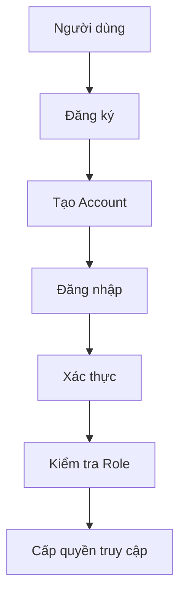

## Business Process Model

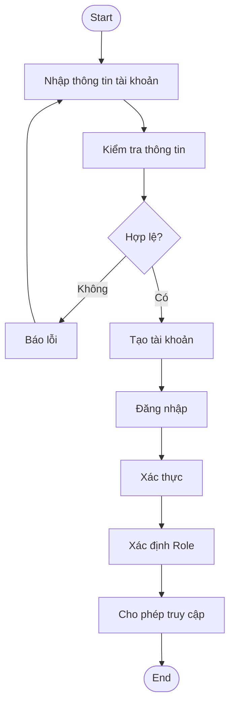

---

# 1.3. BC02 – Booking

## FR

- **FR03:** Nhập điểm đón và điểm trả
- **FR04:** Chọn loại xe và gửi yêu cầu đặt xe

## Workflow

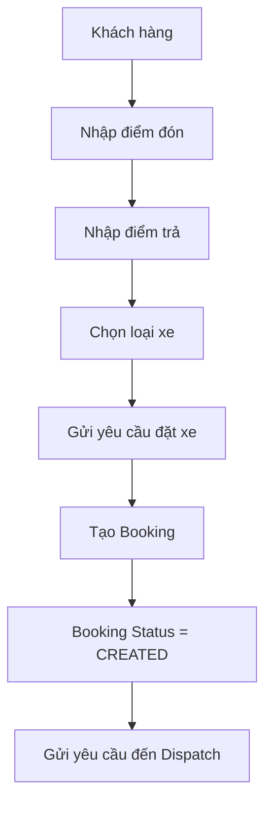

## Business Process Model

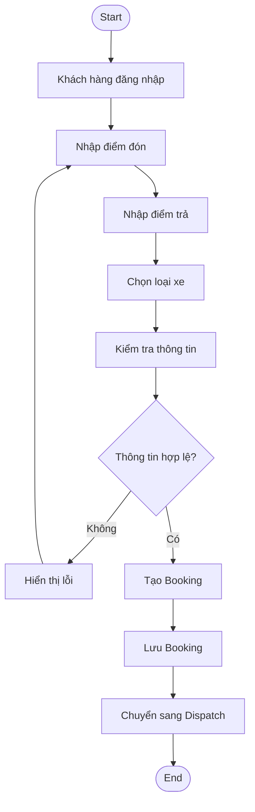

---

# 1.4. BC03 – Driver Dispatch

## FR

- **FR05:** Tự động tìm tài xế phù hợp
- **FR06:** Tiếp tục tìm tài xế khác khi tài xế từ chối hoặc không phản hồi

## Workflow

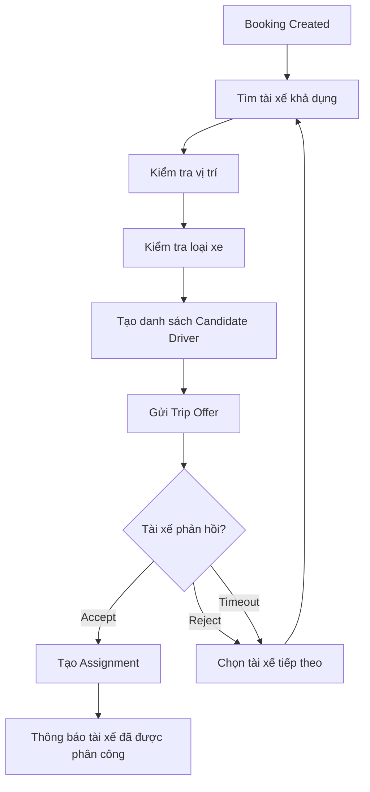

## Business Process Model

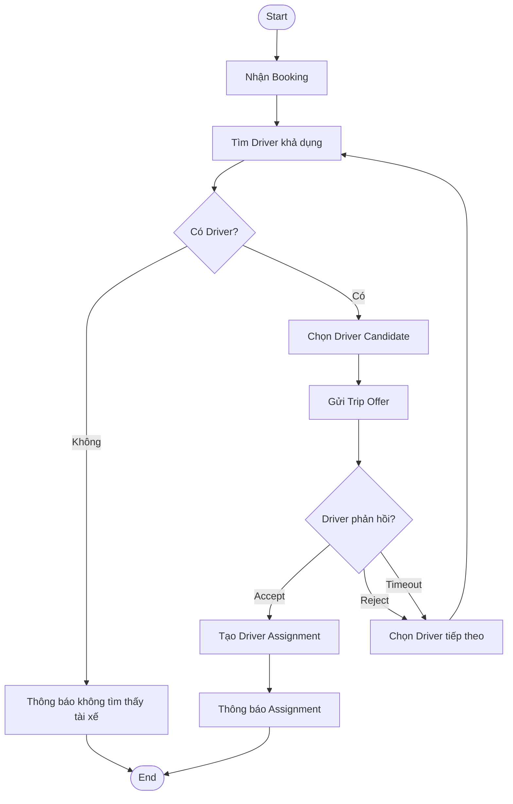

---

# 1.5. BC04 – Trip Management

## FR

- **FR07:** Tài xế cập nhật trạng thái chuyến đi

## Workflow

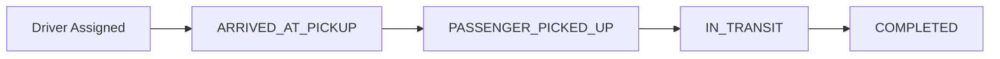

## Business Process Model

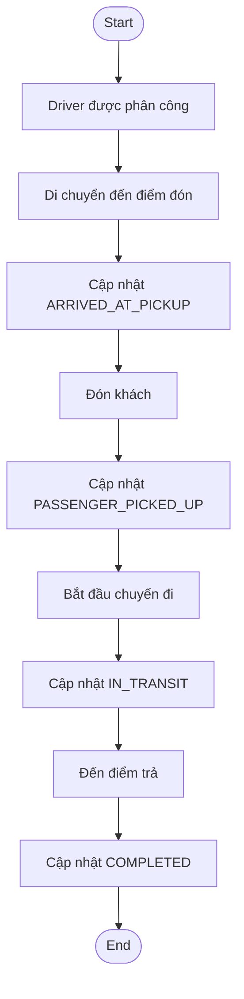

## Trip State Model

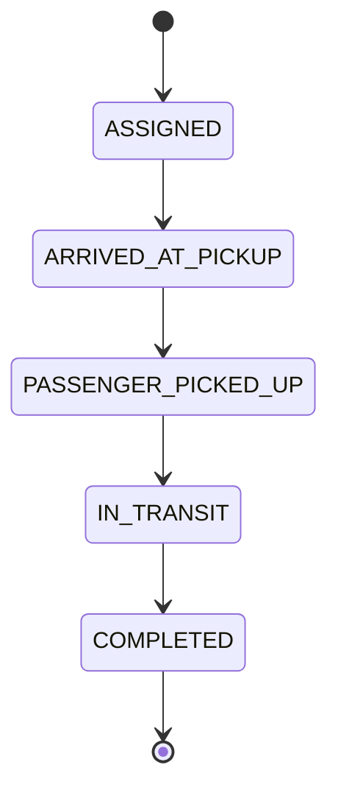

---

# 1.6. BC05 – Pricing & Payment

## FR

- **FR08:** Tính cước và xử lý thanh toán

## Workflow

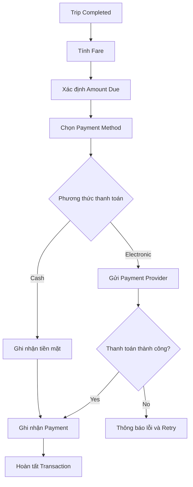

## Business Process Model

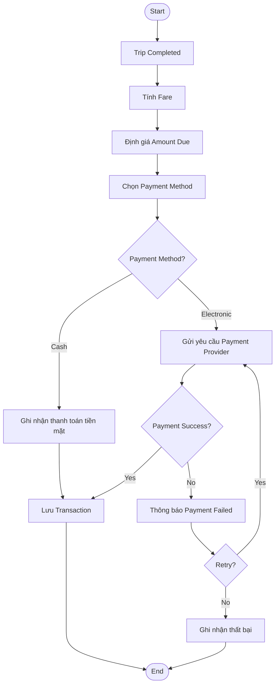

---

# 1.7. BC06 – Notification

## FR

- **FR09:** Gửi thông báo cho người dùng

## Workflow

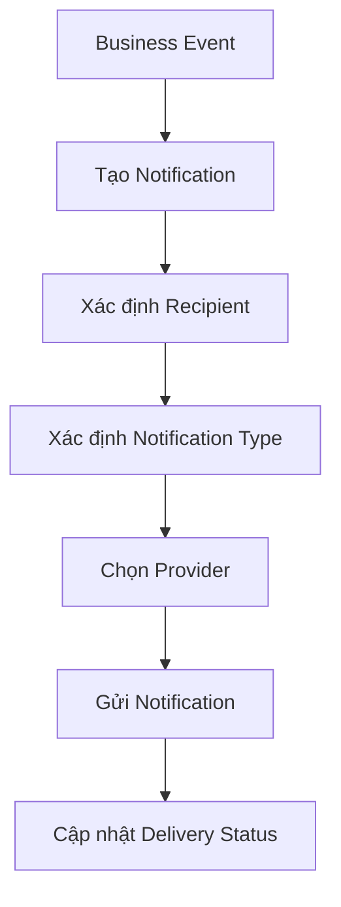

## Business Process Model

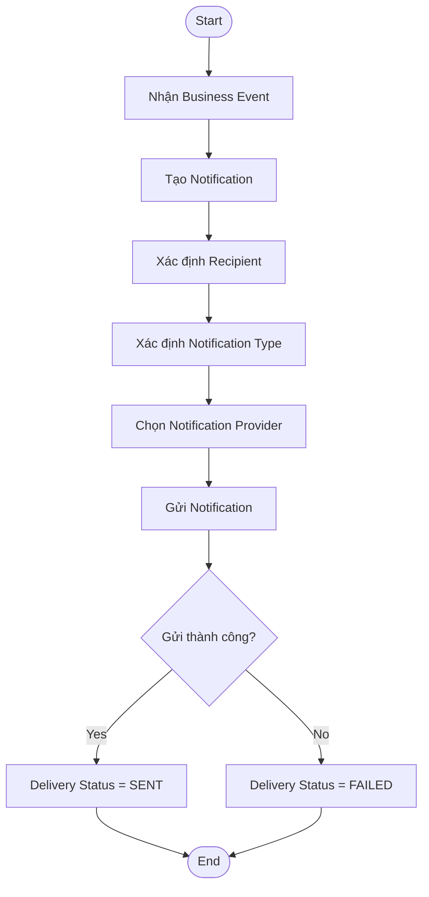

---

# 1.8. BC07 – Operations & Reporting

## FR

- **FR10:** Nhân viên vận hành quản lý khách hàng, tài xế, phương tiện và chuyến đi

## Workflow

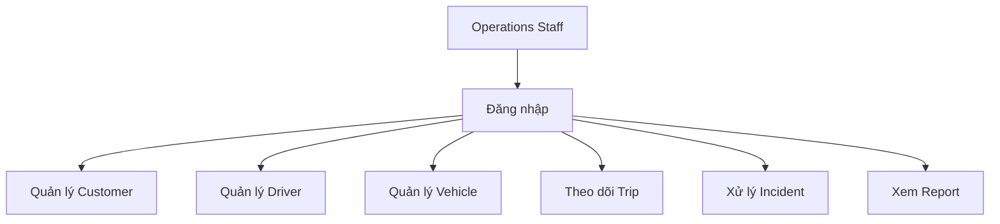

## Business Process Model

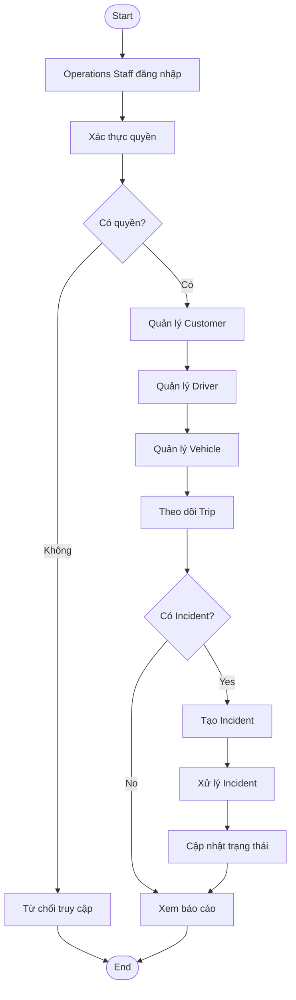

---

# 1.9. Tổng Business Process của hệ thống

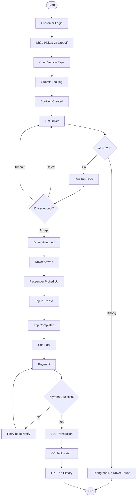

---

# BƯỚC 2. XÂY DỰNG UBIQUITOUS LANGUAGE

## 2.1. BC01 – Identity & Access

| Term | Ý nghĩa |
|---|---|
| User | Người sử dụng hệ thống |
| Account | Tài khoản đăng nhập |
| Role | Vai trò của người dùng |
| Permission | Quyền truy cập |
| Authentication | Xác thực danh tính |
| Authorization | Kiểm tra quyền |
| Login | Đăng nhập |
| Register | Đăng ký |

---

## 2.2. BC02 – Booking

| Term | Ý nghĩa |
|---|---|
| Booking | Yêu cầu đặt xe |
| Customer | Khách hàng |
| Pickup Location | Điểm đón |
| Drop-off Location | Điểm trả |
| Vehicle Type | Loại phương tiện |
| Booking Status | Trạng thái đặt xe |
| Submit Booking | Gửi yêu cầu đặt xe |
| Cancel Booking | Hủy yêu cầu đặt xe |

---

## 2.3. BC03 – Driver Dispatch

| Term | Ý nghĩa |
|---|---|
| Driver Candidate | Tài xế có khả năng nhận chuyến |
| Available Driver | Tài xế đang sẵn sàng |
| Driver Location | Vị trí hiện tại của tài xế |
| Matching | Quá trình tìm tài xế phù hợp |
| Dispatch | Phân phối chuyến cho tài xế |
| Trip Offer | Lời mời nhận chuyến |
| Accept | Chấp nhận chuyến |
| Reject | Từ chối chuyến |
| Timeout | Không phản hồi trong thời gian quy định |
| Assignment | Kết quả phân công tài xế |

---

## 2.4. BC04 – Trip Management

| Term | Ý nghĩa |
|---|---|
| Trip | Chuyến đi |
| Trip Status | Trạng thái chuyến đi |
| Arrived at Pickup | Tài xế đã đến điểm đón |
| Passenger Picked Up | Đã đón khách |
| In Transit | Đang di chuyển |
| Completed | Chuyến đi hoàn thành |
| Trip Status History | Lịch sử thay đổi trạng thái |
| Trip Location | Vị trí của chuyến đi |

---

## 2.5. BC05 – Pricing & Payment

| Term | Ý nghĩa |
|---|---|
| Fare | Cước chuyến đi |
| Fare Calculation | Tính cước |
| Amount Due | Số tiền cần thanh toán |
| Payment | Thanh toán |
| Payment Method | Phương thức thanh toán |
| Payment Provider | Nhà cung cấp thanh toán |
| Transaction | Giao dịch |
| Payment Status | Trạng thái thanh toán |
| Retry | Thực hiện lại thanh toán |

---

## 2.6. BC06 – Notification

| Term | Ý nghĩa |
|---|---|
| Notification | Thông báo |
| Recipient | Người nhận |
| Notification Type | Loại thông báo |
| Provider | Nhà cung cấp dịch vụ thông báo |
| Delivery Status | Trạng thái gửi |
| Delivery Attempt | Lần thử gửi |

---

## 2.7. BC07 – Operations & Reporting

| Term | Ý nghĩa |
|---|---|
| Operator | Nhân viên vận hành |
| Incident | Sự cố |
| Trip Monitoring | Theo dõi chuyến đi |
| Customer Management | Quản lý khách hàng |
| Driver Management | Quản lý tài xế |
| Vehicle Management | Quản lý phương tiện |
| Report | Báo cáo |
| Revenue | Doanh thu |
| Completion Rate | Tỷ lệ hoàn thành |
| Cancellation Rate | Tỷ lệ hủy |

---

# BƯỚC 3. CHUYỂN BOUNDED CONTEXT THÀNH MICROSERVICE VÀ API

## 3.1. Danh sách Microservice

| Bounded Context | Microservice | Trách nhiệm |
|---|---|---|
| Identity & Access | identity-service | Authentication và Authorization |
| Booking | booking-service | Quản lý Booking |
| Driver Dispatch | dispatch-service | Tìm và phân công Driver |
| Trip Management | trip-service | Quản lý Trip |
| Pricing & Payment | payment-service | Fare và Payment |
| Notification | notification-service | Gửi Notification |
| Operations & Reporting | operations-service | Vận hành và Reporting |

---

# 3.2. Identity Service

Base URL:

`/api/v1`

| Method | API | Chức năng |
|---|---|---|
| POST | `/auth/register` | Đăng ký |
| POST | `/auth/login` | Đăng nhập |
| GET | `/users/{id}` | Lấy thông tin User |
| PUT | `/users/{id}` | Cập nhật User |
| GET | `/users/{id}/roles` | Lấy Role |

---

# 3.3. Booking Service

| Method | API | Chức năng |
|---|---|---|
| POST | `/bookings` | Tạo Booking |
| GET | `/bookings/{id}` | Xem Booking |
| GET | `/bookings/customer/{customerId}` | Danh sách Booking của Customer |
| POST | `/bookings/{id}/cancel` | Hủy Booking |
| PATCH | `/bookings/{id}/status` | Cập nhật trạng thái Booking |

---

# 3.4. Dispatch Service

| Method | API | Chức năng |
|---|---|---|
| POST | `/dispatches` | Tạo Dispatch |
| GET | `/dispatches/{id}` | Xem Dispatch |
| GET | `/drivers/available` | Tìm Driver khả dụng |
| POST | `/dispatches/{id}/accept` | Driver nhận chuyến |
| POST | `/dispatches/{id}/reject` | Driver từ chối |
| POST | `/dispatches/{id}/timeout` | Xử lý Timeout |
| POST | `/assignments` | Tạo Assignment |

---

# 3.5. Trip Service

| Method | API | Chức năng |
|---|---|---|
| POST | `/trips` | Tạo Trip |
| GET | `/trips/{id}` | Xem Trip |
| PATCH | `/trips/{id}/status` | Cập nhật Trip Status |
| GET | `/trips/customer/{id}` | Trip của Customer |
| GET | `/trips/driver/{id}` | Trip của Driver |
| GET | `/trips/{id}/tracking` | Theo dõi Trip |

---

# 3.6. Payment Service

| Method | API | Chức năng |
|---|---|---|
| POST | `/fares/calculate` | Tính Fare |
| GET | `/fares/{tripId}` | Xem Fare |
| POST | `/payments` | Tạo Payment |
| GET | `/payments/{id}` | Xem Payment |
| POST | `/payments/{id}/retry` | Retry Payment |
| POST | `/payments/webhook` | Nhận kết quả Payment Provider |
| GET | `/transactions/{id}` | Xem Transaction |

---

# 3.7. Notification Service

| Method | API | Chức năng |
|---|---|---|
| POST | `/notifications` | Tạo Notification |
| GET | `/notifications/{id}` | Xem Notification |
| GET | `/notifications/user/{id}` | Notification của User |
| POST | `/notifications/{id}/send` | Gửi Notification |
| PATCH | `/notifications/{id}/status` | Cập nhật Delivery Status |

---

# 3.8. Operations Service

| Method | API | Chức năng |
|---|---|---|
| GET | `/operations/customers` | Quản lý Customer |
| GET | `/operations/drivers` | Quản lý Driver |
| GET | `/operations/vehicles` | Quản lý Vehicle |
| GET | `/operations/trips` | Theo dõi Trip |
| POST | `/incidents` | Tạo Incident |
| PATCH | `/incidents/{id}` | Cập nhật Incident |
| GET | `/reports/trips` | Báo cáo chuyến đi |
| GET | `/reports/revenue` | Báo cáo doanh thu |
| GET | `/reports/drivers` | Báo cáo Driver |

---

# 3.9. Giao tiếp giữa các Microservice

Các Microservice không truy cập trực tiếp Database của nhau.

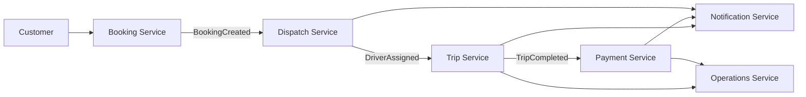

## Các Domain Event chính

| Event | Producer | Consumer |
|---|---|---|
| BookingCreated | Booking Service | Dispatch Service |
| DriverAssigned | Dispatch Service | Trip Service |
| TripStarted | Trip Service | Notification, Operations |
| TripCompleted | Trip Service | Payment, Operations |
| PaymentCompleted | Payment Service | Notification, Operations |
| PaymentFailed | Payment Service | Notification, Operations |
| NoDriverFound | Dispatch Service | Notification, Operations |
| IncidentCreated | Operations Service | Notification Service |

---

# BƯỚC 4. DATA MODEL VÀ AGGREGATE

## 4.1. Identity Service

### Aggregate

**Root:** UserAccount

### Entities

- User
- Role
- Permission

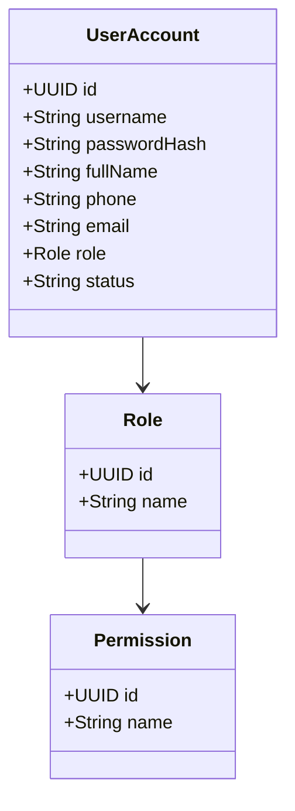

---

## 4.2. Booking Service

### Aggregate

**Root:** Booking

### Entities

- Booking
- PickupLocation
- DropoffLocation
- VehicleType

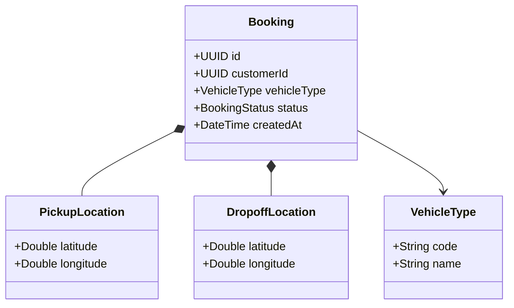

---

## 4.3. Dispatch Service

### Aggregate

**Root:** Dispatch

### Entities

- Dispatch
- CandidateDriver
- DriverAssignment

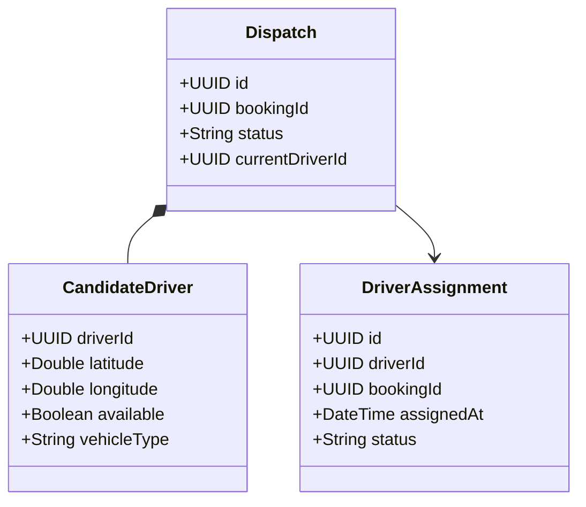

---

## 4.4. Trip Service

### Aggregate

**Root:** Trip

### Entities

- Trip
- TripStatusHistory
- TripLocation

```mermaid
classDiagram
    class Trip {
        +UUID id
        +UUID bookingId
        +UUID customerId
        +UUID driverId
        +UUID vehicleId
        +String status
        +DateTime startedAt
        +DateTime completedAt
    }

    class TripStatusHistory {
        +UUID id
        +UUID tripId
        +String status
        +DateTime changedAt
    }

    class TripLocation {
        +Double latitude
        +Double longitude
        +DateTime recordedAt
    }

    Trip *-- TripStatusHistory
    Trip *-- TripLocation
```

---

## 4.5. Payment Service

### Aggregate

**Root:** Payment

### Entities

- Payment
- Fare
- Transaction

```mermaid
classDiagram
    class Payment {
        +UUID id
        +UUID tripId
        +Decimal amount
        +String paymentMethod
        +String status
        +String providerTransactionId
        +DateTime createdAt
    }

    class Fare {
        +UUID id
        +UUID tripId
        +Decimal amount
        +String currency
    }

    class Transaction {
        +UUID id
        +UUID paymentId
        +String provider
        +String providerTransactionId
        +Decimal amount
        +String status
        +DateTime createdAt
    }

    Payment *-- Fare
    Payment *-- Transaction
```

---

## 4.6. Notification Service

### Aggregate

**Root:** Notification

### Entities

- Notification
- Recipient
- DeliveryAttempt

```mermaid
classDiagram
    class Notification {
        +UUID id
        +UUID recipientId
        +String type
        +String title
        +String content
        +String status
        +DateTime createdAt
    }

    class Recipient {
        +UUID userId
        +String channel
        +String address
    }

    class DeliveryAttempt {
        +UUID id
        +UUID notificationId
        +String provider
        +String status
        +DateTime sentAt
    }

    Notification *-- Recipient
    Notification *-- DeliveryAttempt
```

---

## 4.7. Operations Service

### Aggregate

**Root:** Incident

### Entities

- Incident
- Report

```mermaid
classDiagram
    class Incident {
        +UUID id
        +UUID tripId
        +String type
        +String description
        +String status
        +UUID createdBy
        +DateTime createdAt
        +DateTime resolvedAt
    }

    class Report {
        +UUID id
        +String type
        +DateTime fromDate
        +DateTime toDate
        +Decimal value
    }

    Incident --> Report
```

---

# 4.8. Tổng quan Aggregate của hệ thống

| Microservice | Aggregate Root | Thành phần chính |
|---|---|---|
| identity-service | UserAccount | User, Role, Permission |
| booking-service | Booking | PickupLocation, DropoffLocation, VehicleType |
| dispatch-service | Dispatch | CandidateDriver, DriverAssignment |
| trip-service | Trip | TripStatusHistory, TripLocation |
| payment-service | Payment | Fare, Transaction |
| notification-service | Notification | Recipient, DeliveryAttempt |
| operations-service | Incident | Incident, Report |

---

# BƯỚC 5. LỰA CHỌN DATABASE VÀ XÂY DỰNG DATABASE

## 5.1. Nguyên tắc lựa chọn Database

Hệ thống sử dụng mô hình Database-per-Service.

Mỗi Microservice sở hữu Database riêng và không truy cập trực tiếp Database của Microservice khác.

| Database | Loại | Lý do |
|---|---|---|
| Identity | PostgreSQL | Quan hệ rõ ràng, cần tính toàn vẹn dữ liệu |
| Booking | PostgreSQL | Booking có dữ liệu có cấu trúc |
| Dispatch | MongoDB | Phù hợp dữ liệu Driver Candidate và tìm kiếm vị trí |
| Trip | PostgreSQL | Trip có quan hệ rõ ràng và cần transaction |
| Payment | PostgreSQL | Thanh toán cần tính chính xác và transaction |
| Notification | MongoDB | Dữ liệu Notification linh hoạt |
| Operations | PostgreSQL | Báo cáo và quan hệ dữ liệu rõ ràng |

---

# 5.2. Identity Database – PostgreSQL

## Bảng Users

```sql
CREATE TABLE users (
    id UUID PRIMARY KEY,
    username VARCHAR(100) UNIQUE NOT NULL,
    password_hash VARCHAR(255) NOT NULL,
    full_name VARCHAR(150),
    phone VARCHAR(20),
    email VARCHAR(150),
    role VARCHAR(50) NOT NULL,
    status VARCHAR(30) NOT NULL,
    created_at TIMESTAMP DEFAULT CURRENT_TIMESTAMP
);
```

## Dữ liệu mẫu

```sql
INSERT INTO users
(id, username, password_hash, full_name, phone, email, role, status)
VALUES
(
    '11111111-1111-1111-1111-111111111111',
    'customer01',
    'hashed_password',
    'Nguyen Van A',
    '0900000001',
    'customer@gmail.com',
    'CUSTOMER',
    'ACTIVE'
);
```

---

# 5.3. Booking Database – PostgreSQL

## Bảng Bookings

```sql
CREATE TABLE bookings (
    id UUID PRIMARY KEY,
    customer_id UUID NOT NULL,
    pickup_lat DECIMAL(10,7) NOT NULL,
    pickup_lng DECIMAL(10,7) NOT NULL,
    dropoff_lat DECIMAL(10,7) NOT NULL,
    dropoff_lng DECIMAL(10,7) NOT NULL,
    vehicle_type VARCHAR(50) NOT NULL,
    status VARCHAR(30) NOT NULL,
    created_at TIMESTAMP DEFAULT CURRENT_TIMESTAMP
);
```

## Dữ liệu mẫu

```sql
INSERT INTO bookings
(
    id,
    customer_id,
    pickup_lat,
    pickup_lng,
    dropoff_lat,
    dropoff_lng,
    vehicle_type,
    status
)
VALUES
(
    '22222222-2222-2222-2222-222222222222',
    '11111111-1111-1111-1111-111111111111',
    10.7765,
    106.7009,
    10.8231,
    106.6297,
    'CAR_4',
    'CREATED'
);
```

---

# 5.4. Dispatch Database – MongoDB

Dispatch sử dụng MongoDB vì cần lưu dữ liệu Candidate Driver và hỗ trợ tìm kiếm tài xế theo vị trí.

## Collection: dispatches

```javascript
{
    "_id": "dispatch001",
    "bookingId": "22222222-2222-2222-2222-222222222222",
    "status": "SEARCHING",
    "currentDriverId": null,
    "candidateDrivers": [
        {
            "driverId": "driver001",
            "latitude": 10.7770,
            "longitude": 106.7015,
            "available": true,
            "vehicleType": "CAR_4"
        },
        {
            "driverId": "driver002",
            "latitude": 10.7800,
            "longitude": 106.7040,
            "available": true,
            "vehicleType": "CAR_4"
        }
    ]
}
```

## Geospatial Index

```javascript
db.dispatches.createIndex({
    "candidateDrivers.location": "2dsphere"
});
```

---

# 5.5. Trip Database – PostgreSQL

## Bảng Trips

```sql
CREATE TABLE trips (
    id UUID PRIMARY KEY,
    booking_id UUID NOT NULL,
    customer_id UUID NOT NULL,
    driver_id UUID NOT NULL,
    vehicle_id UUID,
    pickup_lat DECIMAL(10,7),
    pickup_lng DECIMAL(10,7),
    dropoff_lat DECIMAL(10,7),
    dropoff_lng DECIMAL(10,7),
    status VARCHAR(40) NOT NULL,
    started_at TIMESTAMP,
    completed_at TIMESTAMP
);
```

## Bảng Trip Status History

```sql
CREATE TABLE trip_status_history (
    id UUID PRIMARY KEY,
    trip_id UUID NOT NULL,
    status VARCHAR(40) NOT NULL,
    changed_at TIMESTAMP DEFAULT CURRENT_TIMESTAMP
);
```

## Dữ liệu mẫu

```sql
INSERT INTO trips
(
    id,
    booking_id,
    customer_id,
    driver_id,
    vehicle_id,
    status
)
VALUES
(
    '33333333-3333-3333-3333-333333333333',
    '22222222-2222-2222-2222-222222222222',
    '11111111-1111-1111-1111-111111111111',
    '44444444-4444-4444-4444-444444444444',
    '55555555-5555-5555-5555-555555555555',
    'ASSIGNED'
);
```

---

# 5.6. Payment Database – PostgreSQL

## Bảng Payments

```sql
CREATE TABLE payments (
    id UUID PRIMARY KEY,
    trip_id UUID NOT NULL,
    amount DECIMAL(12,2) NOT NULL,
    payment_method VARCHAR(30) NOT NULL,
    status VARCHAR(30) NOT NULL,
    provider_transaction_id VARCHAR(150),
    created_at TIMESTAMP DEFAULT CURRENT_TIMESTAMP
);
```

## Bảng Transactions

```sql
CREATE TABLE transactions (
    id UUID PRIMARY KEY,
    payment_id UUID NOT NULL,
    provider VARCHAR(100),
    provider_transaction_id VARCHAR(150),
    amount DECIMAL(12,2) NOT NULL,
    status VARCHAR(30) NOT NULL,
    created_at TIMESTAMP DEFAULT CURRENT_TIMESTAMP
);
```

## Dữ liệu mẫu

```sql
INSERT INTO payments
(
    id,
    trip_id,
    amount,
    payment_method,
    status
)
VALUES
(
    '66666666-6666-6666-6666-666666666666',
    '33333333-3333-3333-3333-333333333333',
    85000,
    'ELECTRONIC',
    'SUCCESS'
);
```

---

# 5.7. Notification Database – MongoDB

## Collection: notifications

```javascript
{
    "_id": "notification001",
    "recipientId": "11111111-1111-1111-1111-111111111111",
    "type": "DRIVER_ASSIGNED",
    "title": "Tài xế đã được phân công",
    "content": "Tài xế Nguyễn Văn B đang đến điểm đón.",
    "status": "SENT",
    "createdAt": "2026-09-23T10:00:00Z"
}
```

---

# 5.8. Operations Database – PostgreSQL

## Bảng Incidents

```sql
CREATE TABLE incidents (
    id UUID PRIMARY KEY,
    trip_id UUID,
    type VARCHAR(100) NOT NULL,
    description TEXT,
    status VARCHAR(30) NOT NULL,
    created_by UUID NOT NULL,
    created_at TIMESTAMP DEFAULT CURRENT_TIMESTAMP,
    resolved_at TIMESTAMP
);
```

## Dữ liệu mẫu

```sql
INSERT INTO incidents
(
    id,
    trip_id,
    type,
    description,
    status,
    created_by
)
VALUES
(
    '77777777-7777-7777-7777-777777777777',
    '33333333-3333-3333-3333-333333333333',
    'DRIVER_DELAY',
    'Tài xế đến điểm đón trễ',
    'OPEN',
    '88888888-8888-8888-8888-888888888888'
);
```

---

# 5.9. Tổng hợp Database

```mermaid
flowchart TD
    A[identity-service] --> ADB[(PostgreSQL)]
    B[booking-service] --> BDB[(PostgreSQL)]
    C[dispatch-service] --> CDB[(MongoDB)]
    D[trip-service] --> DDB[(PostgreSQL)]
    E[payment-service] --> EDB[(PostgreSQL)]
    F[notification-service] --> FDB[(MongoDB)]
    G[operations-service] --> GDB[(PostgreSQL)]
```

---

# 5.10. Nguyên tắc Database-per-Service

```mermaid
flowchart LR
    A[Identity Service] --> DB1[(Identity DB)]
    B[Booking Service] --> DB2[(Booking DB)]
    C[Dispatch Service] --> DB3[(Dispatch DB)]
    D[Trip Service] --> DB4[(Trip DB)]
    E[Payment Service] --> DB5[(Payment DB)]
    F[Notification Service] --> DB6[(Notification DB)]
    G[Operations Service] --> DB7[(Operations DB)]
```

Mỗi Microservice chỉ được phép quản lý Database của chính mình.

Không Microservice nào truy cập trực tiếp Database của Microservice khác.

Việc trao đổi dữ liệu giữa các Microservice được thực hiện thông qua:

- REST API
- Domain Event
- Message Broker nếu hệ thống triển khai bất đồng bộ

---

# KẾT LUẬN

Hệ thống CAB được phân chia thành 7 Bounded Context theo Domain-Driven Design:

1. Identity & Access
2. Booking
3. Driver Dispatch
4. Trip Management
5. Pricing & Payment
6. Notification
7. Operations & Reporting

Mỗi Bounded Context được triển khai thành một Microservice độc lập.

Kiến trúc sử dụng Database-per-Service giúp các Microservice độc lập về dữ liệu, có thể mở rộng riêng và giảm sự phụ thuộc giữa các thành phần.

PostgreSQL được sử dụng cho các nghiệp vụ cần dữ liệu có cấu trúc, quan hệ và transaction mạnh như Identity, Booking, Trip, Payment và Operations.

MongoDB được sử dụng cho Dispatch và Notification vì các dữ liệu này có cấu trúc linh hoạt và Dispatch cần hỗ trợ xử lý dữ liệu vị trí.

Các Microservice giao tiếp thông qua REST API và Domain Event thay vì truy cập trực tiếp Database của nhau.
