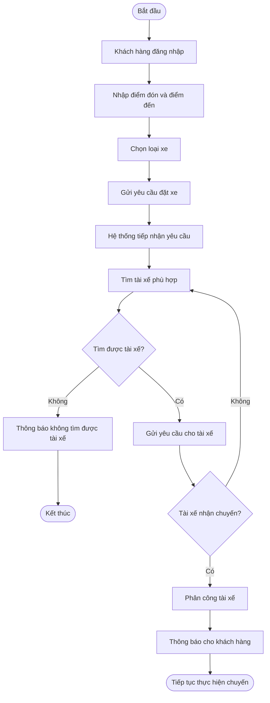
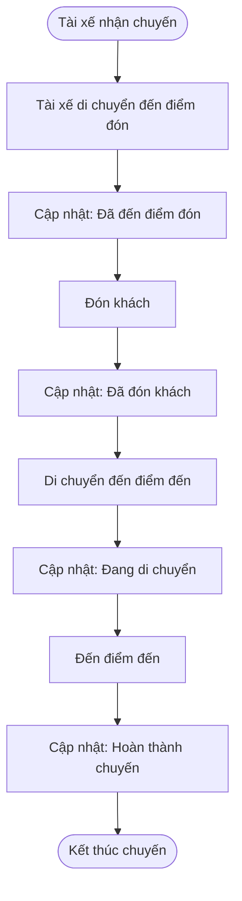
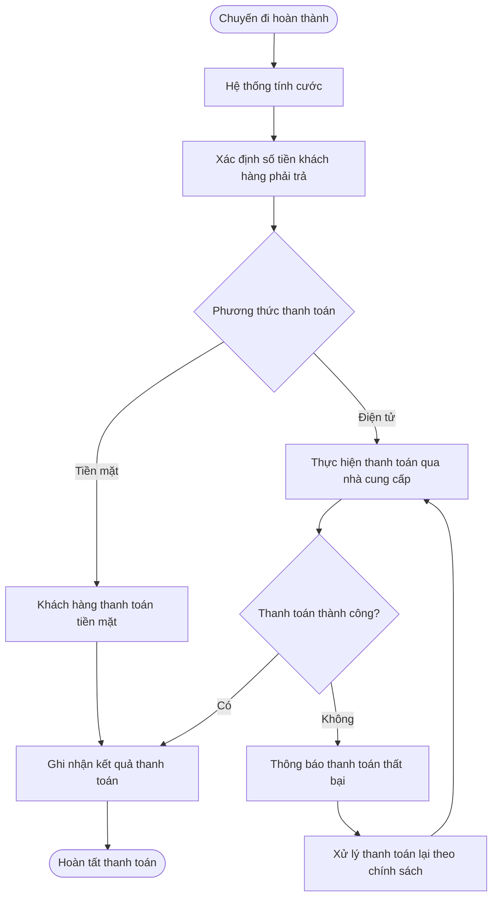
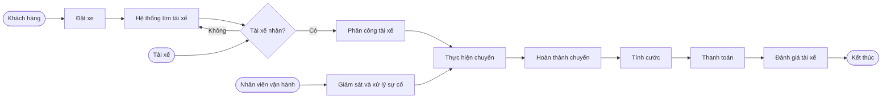
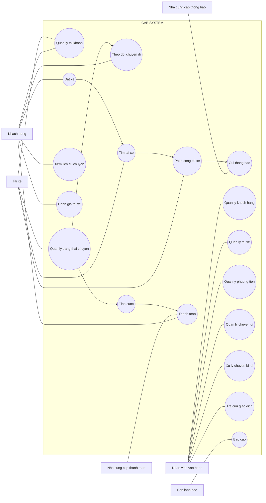

B1. Vấn đề nghiệp vụ

1. Business Context – Ngữ cảnh nghiệp vụ

Công ty ABC kinh doanh dịch vụ đặt xe trực tuyến. Hiện khách hàng có thể đặt xe qua tổng đài hoặc ứng dụng đơn giản, nhưng hệ thống hiện tại còn hạn chế: phân công tài xế chủ yếu thủ công, khách hàng khó theo dõi chuyến đi, thanh toán chưa được quản lý tập trung và khó mở rộng khi số lượng khách hàng tăng.

2. Business Problem – Vấn đề nghiệp vụ

Doanh nghiệp cần xây dựng một nền tảng CAB mới để:

Tự động tìm và phân công tài xế phù hợp.
Cho khách hàng theo dõi trạng thái chuyến đi.
Quản lý tập trung thông tin chuyến đi và thanh toán.
Hỗ trợ số lượng lớn khách hàng và tài xế.
Giúp nhân viên vận hành quản lý, giám sát và xử lý sự cố.
Có khả năng mở rộng thêm chức năng trong tương lai.

3. Hệ thống mới mang lại lợi ích gì cho doanh nghiệp?
   
Giúp doanh nghiệp giảm công việc thủ công, quản lý tập trung, dễ giám sát hoạt động, có báo cáo, đồng thời có thể phục vụ số lượng lớn khách hàng và mở rộng thêm các chức năng trong tương lai.

4. Khách hàng muốn giải quyết vấn đề gì?

Khách hàng muốn giải quyết tình trạng hệ thống đặt xe hiện tại còn thủ công, khó theo dõi, thanh toán chưa tập trung và khó mở rộng. Vì vậy, công ty muốn xây dựng một nền tảng CAB mới có khả năng tự động tìm tài xế, quản lý toàn bộ quy trình đặt xe – thực hiện chuyến – thanh toán – thông báo, đồng thời có khả năng mở rộng trong tương lai

5. Giá trị hệ thống mới so với hệ thống cũ là gì?

Hệ thống mới tốt hơn ở các điểm:

Tự động hóa việc tìm và phân công tài xế thay vì làm thủ công.
Minh bạch hơn: khách hàng biết đang tìm tài xế nào, tài xế đã nhận chưa và trạng thái chuyến.
Quản lý tập trung: chuyến đi, thanh toán, khách hàng, tài xế và phương tiện được quản lý trên một nền tảng.
Dễ mở rộng: có thể thêm dịch vụ, phương thức thanh toán và kênh thông báo mới.
Hỗ trợ vận hành tốt hơn: nhân viên có giao diện quản trị và báo cáo hoạt động.
Ổn định và linh hoạt hơn khi lượng người dùng tăng.

6. Ai sẽ là người sử dụng hệ thống?

Có 3 nhóm người dùng chính:

Người sử dụng	Mục đích
Khách hàng:	Đăng ký, đặt xe, theo dõi chuyến, thanh toán, xem lịch sử và đánh giá tài xế
Tài xế:	Nhận/từ chối chuyến, cập nhật trạng thái chuyến và thông tin vị trí
Nhân viên vận hành:	Quản lý khách hàng, tài xế, xe, chuyến đi và xử lý các trường hợp lỗi

B2. Xác định StakeHolder

1. Bảng vai trò stakeholder
   
| **Stakeholder**                    | **Vai trò**                                                                                                                |
| ---------------------------------- | -------------------------------------------------------------------------------------------------------------------------- |
| **Khách hàng**                     | Sử dụng hệ thống để đăng ký, đặt xe, theo dõi chuyến đi, thanh toán, xem lịch sử và đánh giá tài xế.                       |
| **Tài xế**                         | Nhận hoặc từ chối chuyến, cập nhật trạng thái chuyến, thông tin phương tiện và vị trí.                                     |
| **Nhân viên vận hành**             | Quản lý khách hàng, tài xế, phương tiện, chuyến đi; theo dõi và xử lý các trường hợp chuyến bị lỗi.                        |
| **Ban lãnh đạo**                   | Đưa ra yêu cầu và theo dõi hiệu quả hoạt động thông qua các báo cáo như số chuyến, doanh thu, tỷ lệ hoàn thành, tỷ lệ hủy. |
| **Nhà cung cấp thanh toán**        | Cung cấp dịch vụ thanh toán điện tử cho hệ thống CAB.                                                                      |
| **Nhà cung cấp dịch vụ thông báo** | Hỗ trợ gửi thông báo đến khách hàng và tài xế; có thể được thay đổi hoặc mở rộng trong tương lai.                          |
| **Business Analyst (BA)**          | Làm rõ yêu cầu với các bên liên quan, xác định phạm vi, tác nhân, quy trình nghiệp vụ, yêu cầu và các vấn đề chưa rõ.      |
| **Nhóm phát triển hệ thống**       | Xây dựng và triển khai hệ thống CAB dựa trên các yêu cầu nghiệp vụ đã được xác định.                                       |

2. Ma trận để xác định mức độ ảnh hưởng của các Stakeholder

                       STAKEHOLDER MATRIX
              MỨC ĐỘ QUAN TÂM (INTEREST)
                       THẤP          CAO
                    ┌───────────┬───────────────┐
        CAO         │ Nhà cung  │ BAN LÃNH ĐẠO  │
                    │ cấp thanh │ NHÂN VIÊN     │
MỨC ĐỘ              │ toán      │ VẬN HÀNH      │
ẢNH HƯỞNG           │           │ BA            │
(POWER)             ├───────────┼───────────────┤
        THẤP        │ Nhà cung  │ KHÁCH HÀNG    │
                    │ cấp thông │ TÀI XẾ        │
                    │ báo       │               │
                    └───────────┴───────────────┘
                    
B3. Xác định Business Goal

| **Business Goal**                            | **Mục tiêu**                                                                                                                      |
| -------------------------------------------- | --------------------------------------------------------------------------------------------------------------------------------- |
| **BG1 – Tự động hóa quy trình đặt xe**       | Tự động hóa việc tìm kiếm và phân công tài xế thay cho cách làm thủ công hiện tại.                                                |
| **BG2 – Nâng cao trải nghiệm khách hàng**    | Cho phép khách hàng đặt xe, theo dõi trạng thái chuyến, biết tài xế và thời gian dự kiến đến.                                     |
| **BG3 – Quản lý tập trung**                  | Quản lý tập trung khách hàng, tài xế, phương tiện, chuyến đi và giao dịch thanh toán.                                             |
| **BG4 – Nâng cao hiệu quả vận hành**         | Giúp nhân viên vận hành theo dõi chuyến đi, trạng thái tài xế và xử lý các trường hợp lỗi.                                        |
| **BG5 – Hỗ trợ thanh toán điện tử**          | Tính cước và hỗ trợ thanh toán bằng tiền mặt hoặc phương thức điện tử thông qua nhà cung cấp bên ngoài.                           |
| **BG6 – Đảm bảo khả năng mở rộng**           | Xây dựng nền tảng có thể phục vụ số lượng lớn khách hàng, tài xế và có thể mở rộng thêm tính năng.                                |
| **BG7 – Đảm bảo hệ thống hoạt động ổn định** | Hệ thống phải hoạt động ổn định khi nhu cầu tăng cao và một lỗi ở thanh toán/thông báo không làm toàn bộ hệ thống dừng hoạt động. |
| **BG8 – Đảm bảo bảo mật**                    | Bảo vệ thông tin cá nhân, phương tiện, vị trí và dữ liệu giao dịch; kiểm soát quyền truy cập.                                     |
| **BG9 – Hỗ trợ quản lý và ra quyết định**    | Cung cấp báo cáo về số chuyến, doanh thu, tỷ lệ hoàn thành, tỷ lệ hủy và hiệu quả tài xế cho ban lãnh đạo.                        |
| **BG10 – Phát triển nền tảng lâu dài**       | Cho phép bổ sung dịch vụ mới, phương thức thanh toán và nhà cung cấp thông báo mà không phải xây dựng lại toàn bộ hệ thống.       |

B4.Xác định Scope (Phạm Vi)

1. In Scope – Trong phạm vi
Nhóm chức năng	Phạm vi thực hiện
Quản lý khách hàng:	Đăng ký, đăng nhập, cập nhật thông tin cá nhân.
Đặt xe:	Nhập điểm đón, điểm đến, chọn loại xe và gửi yêu cầu đặt xe.
Quản lý chuyến đi:	Theo dõi trạng thái, thông tin tài xế, thời gian dự kiến đến và lịch sử chuyến đi.
Quản lý tài xế:	Đăng ký/tạo tài khoản, quản lý hồ sơ, phương tiện và trạng thái hoạt động.
Tìm và phân công tài xế:	Tìm tài xế dựa trên vị trí, trạng thái sẵn sàng và tiêu chí vận hành; tự động tìm tài xế khác khi bị từ chối.
Cập nhật trạng thái chuyến:	Đã đến điểm đón, đã đón khách, đang di chuyển và hoàn thành chuyến.
Theo dõi vị trí:	Lưu vị trí tài xế để hỗ trợ tìm tài xế gần khách hàng và dự kiến thời gian đến.
Tính cước:	Xác định số tiền dựa trên loại dịch vụ và thông tin chuyến đi.
Thanh toán:	Hỗ trợ tiền mặt và thanh toán điện tử qua nhà cung cấp bên ngoài.
Thông báo:	Gửi thông báo về yêu cầu đặt xe, tài xế nhận chuyến, tài xế đến, hoàn thành chuyến và kết quả thanh toán.
Đánh giá:	Khách hàng đánh giá tài xế sau chuyến đi.
Quản trị hệ thống:	Quản lý khách hàng, tài xế, phương tiện, chuyến đi và xử lý một số trường hợp lỗi.
Báo cáo:	Báo cáo số lượng chuyến, doanh thu, tỷ lệ hoàn thành, tỷ lệ hủy và hiệu quả tài xế.
Bảo mật:	Xác thực người dùng, phân quyền quản trị, bảo vệ dữ liệu và lưu vết thao tác quan trọng.

Phạm vi trên được xác định trực tiếp từ các yêu cầu chức năng và vận hành trong tài liệu.

2. Out of Scope – Ngoài phạm vi

Tài liệu không nêu rõ danh sách Out of Scope, nhưng có thể xác định các nội dung sau là chưa thuộc phạm vi triển khai hiện tại hoặc chưa được chốt:

Ngoài phạm vi / Chưa xác định	Giải thích
Lưu trực tiếp thông tin thẻ ngân hàng:	CAB không lưu trực tiếp dữ liệu nhạy cảm của thẻ hoặc tài khoản thanh toán.
Tự xây dựng hệ thống thanh toán riêng:	Hệ thống dự kiến tích hợp nhà cung cấp thanh toán bên ngoài.
Toàn bộ tính năng dịch vụ trong tương lai:	Các loại dịch vụ mới chỉ là định hướng mở rộng sau này, chưa phải toàn bộ phạm vi hiện tại.
Tiêu chí tính cước chi tiết:	Chưa được khách hàng chốt.
Chính sách hủy chuyến chi tiết:	Chưa được xác định rõ.
Thời gian phản hồi của tài xế:	Cần BA làm rõ thêm.
Cách xử lý khi mất kết nối mạng:	Chưa được chốt.
Thời gian lưu trữ dữ liệu:	Chưa được xác định cụ thể.

Các điểm trên cần được BA xác nhận thêm với stakeholder trước khi chuyển thành yêu cầu chính thức.

B5. Business Requirements

Business Requirements – CAB System
| **Mã**   | **Business Requirement**                                                                                                                           | **Mục tiêu liên quan** |
| -------- | -------------------------------------------------------------------------------------------------------------------------------------------------- | ---------------------- |
| **BR01** | Hệ thống phải hỗ trợ doanh nghiệp **tự động hóa quy trình đặt xe và tìm kiếm tài xế** thay cho việc phân công thủ công.                            | BG1                    |
| **BR02** | Hệ thống phải cho phép **khách hàng đặt và theo dõi chuyến đi** một cách thuận tiện, minh bạch.                                                    | BG2                    |
| **BR03** | Hệ thống phải hỗ trợ **tự động tìm và phân công tài xế phù hợp** dựa trên vị trí, trạng thái sẵn sàng và tiêu chí vận hành.                        | BG1, BG4               |
| **BR04** | Hệ thống phải cung cấp khả năng **quản lý tập trung khách hàng, tài xế, phương tiện và chuyến đi**.                                                | BG3                    |
| **BR05** | Hệ thống phải hỗ trợ doanh nghiệp **quản lý và xử lý thanh toán**, bao gồm tiền mặt và thanh toán điện tử thông qua nhà cung cấp bên ngoài.        | BG5                    |
| **BR06** | Hệ thống phải cung cấp **thông báo kịp thời** cho khách hàng và tài xế trong các giai đoạn quan trọng của chuyến đi.                               | BG2, BG4               |
| **BR07** | Hệ thống phải hỗ trợ nhân viên vận hành **giám sát hoạt động và xử lý các trường hợp chuyến đi bị lỗi**.                                           | BG4                    |
| **BR08** | Hệ thống phải cung cấp **báo cáo hoạt động** để ban lãnh đạo theo dõi số chuyến, doanh thu, tỷ lệ hoàn thành, tỷ lệ hủy và hiệu quả tài xế.        | BG9                    |
| **BR09** | Hệ thống phải có khả năng **phục vụ số lượng lớn khách hàng và tài xế**, đồng thời cho phép các thành phần mở rộng độc lập khi tải tăng.           | BG6                    |
| **BR10** | Hệ thống phải đảm bảo **bảo mật và kiểm soát quyền truy cập** đối với dữ liệu khách hàng, tài xế, phương tiện, vị trí và giao dịch.                | BG8                    |
| **BR11** | Hệ thống phải đảm bảo **hoạt động ổn định**, tránh để lỗi ở một chức năng như thanh toán hoặc thông báo làm ngừng toàn bộ hệ thống.                | BG7                    |
| **BR12** | Hệ thống phải có kiến trúc **linh hoạt để doanh nghiệp có thể bổ sung dịch vụ, phương thức thanh toán và nhà cung cấp thông báo trong tương lai**. | BG10                   |

B6.Business Process

Business Process chính: Quy trình đặt xe

1. Khách hàng tạo yêu cầu đặt xe
→ Đăng nhập → nhập điểm đón, điểm đến → chọn loại xe → gửi yêu cầu đặt xe.

2. Hệ thống tìm tài xế
→ Xác định tài xế phù hợp dựa trên vị trí, trạng thái sẵn sàng và tiêu chí vận hành.

3. Tài xế nhận hoặc từ chối chuyến

Nếu nhận → chuyến được phân công cho tài xế.
Nếu từ chối/không phản hồi → hệ thống tiếp tục tìm tài xế khác.
Nếu không tìm được → thông báo cho khách hàng.

4. Tài xế thực hiện chuyến
→ Đã đến điểm đón → Đã đón khách → Đang di chuyển → Hoàn thành chuyến.

5. Tính cước và thanh toán
→ Hệ thống xác định số tiền phải trả → khách hàng thanh toán bằng tiền mặt hoặc phương thức điện tử → ghi nhận kết quả thanh toán.

6. Hoàn thành và đánh giá
→ Khách hàng xem lịch sử chuyến đi, số tiền phải trả và đánh giá tài xế sau khi chuyến hoàn thành.

B7. Phân rã các yêu cầu chức năng 

FR01: Hệ thống cho phép khách hàng đăng ký tài khoản.
FR02: Hệ thống cho phép khách hàng đăng nhập.
FR03: Hệ thống cho phép khách hàng nhập điểm đón và điểm đến.
FR04: Hệ thống cho phép khách hàng chọn loại xe và gửi yêu cầu đặt xe.
FR05: Hệ thống tự động tìm tài xế phù hợp.
FR06: Hệ thống tiếp tục tìm tài xế khác nếu tài xế từ chối hoặc không phản hồi.
FR07: Hệ thống cho phép tài xế cập nhật trạng thái chuyến.
FR08: Hệ thống cho phép tính cước và xử lý thanh toán.
FR09: Hệ thống gửi thông báo cho khách hàng và tài xế.
FR10: Hệ thống cho phép nhân viên vận hành quản lý khách hàng, tài xế, phương tiện và chuyến đi.

B8. Những quy tắc nghiệp và ngoại lệ

1. Các quy tắc nghiệp vụ
   
Mã	Quy tắc nghiệp vụ	Mô tả
BR01	Chỉ người dùng đã xác thực	Khách hàng và tài xế phải xác thực trước khi sử dụng các chức năng yêu cầu tài khoản.
BR02	Tài xế phải ở trạng thái sẵn sàng	Chỉ tài xế đang ở trạng thái sẵn sàng mới được hệ thống xem xét để nhận chuyến.
BR03	Ưu tiên tài xế phù hợp và gần khách hàng	Hệ thống tìm tài xế dựa trên vị trí, trạng thái sẵn sàng và các tiêu chí vận hành.
BR04	Không yêu cầu khách hàng đặt lại khi tài xế từ chối	Nếu tài xế được đề xuất không nhận chuyến, hệ thống phải tiếp tục tìm tài xế khác.
BR05	Phải thông báo khi không tìm được tài xế	Nếu không tìm được tài xế phù hợp, hệ thống phải thông báo rõ ràng cho khách hàng.
BR06	Tài xế phải cập nhật trạng thái chuyến	Tài xế cập nhật các trạng thái: đã đến điểm đón, đã đón khách, đang di chuyển và hoàn thành chuyến.
BR07	Tính cước sau khi hoàn thành chuyến	Sau khi chuyến đi hoàn thành, hệ thống xác định số tiền khách hàng phải trả.
BR08	Hỗ trợ nhiều phương thức thanh toán	Khách hàng có thể thanh toán bằng tiền mặt hoặc phương thức điện tử.
BR09	Không lưu thông tin thanh toán nhạy cảm trực tiếp	Thông tin nhạy cảm của thẻ hoặc tài khoản thanh toán không được lưu trực tiếp trong CAB.
BR10	Kiểm soát quyền quản trị	Các thao tác quản trị phải được phân quyền, nhân viên thông thường không được thực hiện các thao tác nhạy cảm.
BR11	Bảo vệ dữ liệu	Thông tin cá nhân, phương tiện, vị trí và dữ liệu giao dịch phải được bảo vệ.
BR12	Lưu vết thao tác quan trọng	Hệ thống phải lưu lại các thao tác quan trọng để phục vụ kiểm tra khi có sự cố.

Các quy tắc này được suy ra trực tiếp từ yêu cầu về tìm tài xế, thanh toán, phân quyền và bảo mật trong tài liệu

2. Các ngoại lệ nghiệp vụ
   
Mã	  Ngoại lệ	Cách xử lý
EX01	Tài xế không phản hồi	Hệ thống tiếp tục tìm tài xế khác.
EX02	Tài xế từ chối chuyến	Hệ thống tìm tài xế phù hợp tiếp theo, khách hàng không cần tạo lại yêu cầu.
EX03	Không tìm được tài xế	Thông báo rõ ràng cho khách hàng rằng không tìm được tài xế.
EX04	Thanh toán điện tử thất bại	Thông báo cho khách hàng và cho phép xử lý thanh toán lại theo chính sách doanh nghiệp.
EX05	Chuyến đi bị lỗi	Nhân viên vận hành có thể kiểm tra và hỗ trợ xử lý chuyến bị lỗi.
EX06	Hệ thống gặp lỗi thanh toán/thông báo	Lỗi ở một thành phần không được làm cho toàn bộ hệ thống đặt xe ngừng hoạt động.
EX07	Nhu cầu tăng cao	Các thành phần hệ thống phải có khả năng mở rộng độc lập khi tải tăng.
EX08	Mất kết nối mạng	Chưa có quy tắc xử lý cụ thể; BA cần làm rõ với khách hàng.
EX09	Hủy chuyến	Chưa có chính sách cụ thể; BA cần xác nhận với khách hàng.

B9.Mô hình hoá hệ thống và mô hình hoá dữ liệu

1. Mô hình hóa hệ thống
   Các Actor chính
Khách hàng
Tài xế
Nhân viên vận hành
Ban lãnh đạo
Nhà cung cấp thanh toán
Nhà cung cấp thông báo

2. Mô hình hóa dữ liệu

Mô hình hóa dữ liệu trả lời câu hỏi:

“Hệ thống cần lưu trữ những dữ liệu gì và các dữ liệu đó liên hệ với nhau như thế nào?”

Từ yêu cầu CAB, có thể xác định các Entity chính:

Entity	Một số dữ liệu cần quản lý
KhachHang	Mã khách hàng, họ tên, số điện thoại, email, thông tin cá nhân
TaiXe	Mã tài xế, họ tên, số điện thoại, trạng thái hoạt động
PhuongTien	Mã xe, loại xe, thông tin phương tiện
ChuyenDi	Mã chuyến, điểm đón, điểm đến, trạng thái, thời gian
YeuCauDatXe	Mã yêu cầu, khách hàng, loại xe, điểm đón, điểm đến
ThanhToan	Mã thanh toán, số tiền, phương thức, trạng thái
DanhGia	Mã đánh giá, khách hàng, tài xế, nội dung/điểm đánh giá
ThongBao	Mã thông báo, nội dung, người nhận, trạng thái
TaiKhoan	Tài khoản đăng nhập và thông tin xác thực
LichSuGiaoDich	Thông tin các giao dịch đã thực hiện

Các entity trên được suy ra từ yêu cầu quản lý khách hàng, tài xế, phương tiện, chuyến đi, thanh toán, thông báo và đánh giá trong tài liệu

3. Mối quan hệ quan trọng

Khách hàng → Yêu cầu đặt xe: Một khách hàng có thể tạo nhiều yêu cầu.
Yêu cầu đặt xe → Chuyến đi: Một yêu cầu có thể trở thành một chuyến đi.
Tài xế → Chuyến đi: Một tài xế có thể thực hiện nhiều chuyến.
Phương tiện → Tài xế: Tài xế sử dụng phương tiện để thực hiện chuyến.
Chuyến đi → Thanh toán: Chuyến hoàn thành có thông tin thanh toán.
Chuyến đi → Đánh giá: Sau chuyến, khách hàng có thể đánh giá tài xế.
Khách hàng/Tài xế → Thông báo: Hệ thống gửi thông báo đến hai nhóm người dùng này.

B10.Xác định yêu cầu phi chức năng 

| **Mã**    | **Nhóm NFR**                           | **Yêu cầu phi chức năng**                                                                                                                                         |
| --------- | -------------------------------------- | ----------------------------------------------------------------------------------------------------------------------------------------------------------------- |
| **NFR01** | **Hiệu năng / Khả năng mở rộng**       | Hệ thống phải có khả năng phục vụ **số lượng lớn khách hàng và tài xế**.                                                                                          |
| **NFR02** | **Ổn định**                            | Hệ thống phải hoạt động ổn định, đặc biệt trong **thời điểm nhu cầu tăng cao**.                                                                                   |
| **NFR03** | **Khả năng chịu lỗi**                  | Lỗi ở một chức năng như **thanh toán hoặc thông báo** không được làm toàn bộ hệ thống đặt xe ngừng hoạt                                                           động. |
| **NFR04** | **Scalability**                        | Các thành phần của hệ thống phải có khả năng **mở rộng độc lập khi tải tăng**.                                                                                    |
| **NFR05** | **Maintainability / Khả năng bảo trì** | Chức năng mới có thể được triển khai **từng phần** và hạn chế ảnh hưởng đến các chức năng đang hoạt động.                                                         |
| **NFR06** | **Bảo mật**                            | Khách hàng và tài xế phải được **xác thực** trước khi sử dụng các chức năng yêu cầu tài khoản.                                                                    |
| **NFR07** | **Phân quyền**                         | Các thao tác quản trị phải được **kiểm soát quyền truy cập**, nhân viên thông thường không được thực hiện                                                            các thao tác nhạy cảm.  |
| **NFR08** | **Bảo vệ dữ liệu**                     | Thông tin cá nhân, thông tin phương tiện, dữ liệu vị trí và dữ liệu giao dịch phải được **bảo vệ**.                                                               |
| **NFR09** | **Audit / Logging**                    | Hệ thống phải **lưu vết các thao tác quan trọng** để phục vụ kiểm tra khi xảy ra sự cố.                                                                           |
| **NFR10** | **Khả năng mở rộng chức năng**         | Kiến trúc phải đủ linh hoạt để có thể thêm **dịch vụ mới, phương thức thanh toán mới và nhà cung cấp thông báo mới** mà không phải xây dựng lại toàn bộ ứng dụng. |

B11.Thiết kế Use Case

1. Use Case tổng quát

2. Phân nhóm Use Case

👤 Khách hàng
Use Case	Chức năng
UC01	Quản lý tài khoản
UC02	Đặt xe
UC03	Theo dõi chuyến đi
UC08	Thanh toán
UC10	Xem lịch sử chuyến
UC11	Đánh giá tài xế
Khách hàng có thể đăng ký, đăng nhập, cập nhật thông tin, nhập điểm đón/điểm đến, chọn loại xe, đặt xe, theo dõi chuyến, xem lịch sử, số tiền phải trả và đánh giá tài xế.

🚗 Tài xế
Use Case	Chức năng
UC01	Quản lý tài khoản/hồ sơ
UC04	Cập nhật trạng thái chuyến
UC05	Nhận thông tin yêu cầu phù hợp
UC06	Nhận/chấp nhận hoặc từ chối chuyến

Tài xế có thể cập nhật hồ sơ, phương tiện, trạng thái hoạt động và cập nhật các trạng thái của chuyến như đã đến điểm đón → đã đón khách → đang di chuyển → hoàn thành.

👨‍💼 Nhân viên vận hành
Use Case	Chức năng
UC12	Quản lý khách hàng
UC13	Quản lý tài xế
UC14	Quản lý phương tiện
UC15	Quản lý chuyến đi
UC16	Xử lý chuyến bị lỗi
UC17	Tra cứu lịch sử giao dịch

Nhân viên vận hành có giao diện quản trị để quản lý khách hàng, tài xế, phương tiện, chuyến đi, theo dõi chuyến đang diễn ra và xử lý các trường hợp lỗi.

🏢 Ban lãnh đạo

UC18 – Báo cáo

Ban lãnh đạo sử dụng báo cáo để theo dõi:

Số lượng chuyến
Doanh thu
Tỷ lệ chuyến hoàn thành
Tỷ lệ hủy
Hiệu quả hoạt động của tài xế.
💳 Nhà cung cấp thanh toán

UC08 – Thanh toán

Hệ thống CAB tích hợp với nhà cung cấp thanh toán bên ngoài để xử lý thanh toán điện tử. CAB không lưu trực tiếp thông tin nhạy cảm của thẻ hoặc tài khoản thanh toán.

🔔 Nhà cung cấp thông báo

UC09 – Gửi thông báo

Hệ thống cần gửi thông báo cho khách hàng và tài xế về các sự kiện như nhận yêu cầu, tài xế nhận chuyến, tài xế đến điểm đón, hoàn thành chuyến và kết quả thanh toán.

3. Use Case quan trọng nhất: Đặt xe

Nếu thầy yêu cầu phân rã một Use Case, nên chọn Đặt xe vì đây là nghiệp vụ trung tâm:

UC02 – ĐẶT XE
│
├── Đăng nhập
├── Nhập điểm đón
├── Nhập điểm đến
├── Chọn loại xe
├── Gửi yêu cầu
│
├── Hệ thống tìm tài xế
│   ├── Tìm tài xế phù hợp
│   ├── Gửi yêu cầu cho tài xế
│   ├── Tài xế nhận?
│   │   ├── Có → Phân công tài xế
│   │   └── Không → Tìm tài xế khác
│   └── Không có tài xế → Thông báo khách hàng
│
└── Theo dõi chuyến đi

B12.ĐẶC TẢ USE CASE

1. UC01 – Đăng nhập
| Thành phần          | Nội dung                                                                |
| ------------------- | ----------------------------------------------------------------------- |
| **Tên Use Case**    | Đăng nhập                                                               |
| **Mã**              | UC01                                                                    |
| **Actor**           | Khách hàng, Tài xế, Nhân viên vận hành                                  |
| **Mục tiêu**        | Cho phép người dùng xác thực để sử dụng các chức năng yêu cầu tài khoản |
| **Điều kiện trước** | Người dùng đã có tài khoản                                              |
| **Điều kiện sau**   | Người dùng đăng nhập thành công và được truy cập chức năng phù hợp      |
| **Trigger**         | Người dùng yêu cầu đăng nhập                                            |

Luồng chính:

Người dùng mở chức năng đăng nhập.
Nhập thông tin tài khoản.
Hệ thống xác thực thông tin.
Nếu hợp lệ → cho phép truy cập hệ thống.
Hiển thị các chức năng tương ứng với quyền của người dùng.

Ngoại lệ:

Thông tin đăng nhập không hợp lệ → thông báo lỗi.
Tài khoản không có quyền sử dụng chức năng → từ chối truy cập.

Việc xác thực người dùng là yêu cầu được nêu trong tài liệu.

2. UC02 – Đặt xe

| Thành phần          | Nội dung                                                   |
| ------------------- | ---------------------------------------------------------- |
| **Tên Use Case**    | Đặt xe                                                     |
| **Mã**              | UC02                                                       |
| **Actor chính**     | Khách hàng                                                 |
| **Actor phụ**       | Hệ thống, Tài xế                                           |
| **Mục tiêu**        | Cho phép khách hàng tạo yêu cầu đặt xe                     |
| **Điều kiện trước** | Khách hàng đã đăng nhập                                    |
| **Điều kiện sau**   | Yêu cầu được tiếp nhận và chuyển sang quá trình tìm tài xế |
| **Trigger**         | Khách hàng muốn đặt xe                                     |

Luồng chính:

Khách hàng nhập điểm đón.
Nhập điểm đến.
Chọn loại xe.
Gửi yêu cầu đặt xe.
Hệ thống tiếp nhận yêu cầu.
Hệ thống bắt đầu tìm tài xế phù hợp.
Gửi yêu cầu đến tài xế.
Tài xế chấp nhận chuyến.
Hệ thống phân công tài xế.
Thông báo cho khách hàng.

Tài liệu yêu cầu khách hàng có thể nhập điểm đón, điểm đến, chọn loại xe và gửi yêu cầu đặt xe.

Ngoại lệ:

Không tìm được tài xế → thông báo cho khách hàng.
Tài xế từ chối → hệ thống tiếp tục tìm tài xế khác.
Tài xế không phản hồi → tiếp tục tìm tài xế khác.

3. UC03 – Tìm và phân công tài xế
   
| Thành phần          | Nội dung                                                                       |
| ------------------- | ------------------------------------------------------------------------------ |
| **Tên Use Case**    | Tìm và phân công tài xế                                                        |
| **Mã**              | UC03                                                                           |
| **Actor chính**     | Hệ thống                                                                       |
| **Actor phụ**       | Tài xế                                                                         |
| **Mục tiêu**        | Tìm tài xế phù hợp cho yêu cầu đặt xe                                          |
| **Điều kiện trước** | Khách hàng đã tạo yêu cầu đặt xe                                               |
| **Điều kiện sau**   | Một tài xế được phân công hoặc khách hàng được thông báo không tìm được tài xế |

Luồng chính:

Hệ thống nhận yêu cầu đặt xe.
Xác định các tài xế phù hợp.
Kiểm tra vị trí tài xế.
Kiểm tra trạng thái sẵn sàng.
Xác định tài xế ưu tiên.
Gửi yêu cầu cho tài xế.
Tài xế nhận chuyến.
Hệ thống phân công chuyến cho tài xế.
Thông báo cho khách hàng.

Ngoại lệ:

Tài xế từ chối:
→ Hệ thống tìm tài xế khác.

Tài xế không phản hồi:
→ Hệ thống tiếp tục tìm tài xế khác.

Không còn tài xế phù hợp:
→ Thông báo khách hàng không tìm được tài xế.

Tài liệu xác định việc tìm tài xế dựa trên vị trí, trạng thái sẵn sàng và các tiêu chí vận hành khác.

4. UC04 – Thực hiện chuyến đi
   
| Thành phần          | Nội dung                                |
| ------------------- | --------------------------------------- |
| **Tên Use Case**    | Thực hiện chuyến đi                     |
| **Mã**              | UC04                                    |
| **Actor chính**     | Tài xế                                  |
| **Actor phụ**       | Khách hàng                              |
| **Mục tiêu**        | Thực hiện và cập nhật trạng thái chuyến |
| **Điều kiện trước** | Tài xế đã nhận chuyến                   |
| **Điều kiện sau**   | Chuyến đi hoàn thành                    |
| **Trigger**         | Tài xế bắt đầu thực hiện chuyến         |

Luồng chính:

Tài xế nhận chuyến.
Tài xế di chuyển đến điểm đón.
Cập nhật trạng thái Đã đến điểm đón.
Đón khách.
Cập nhật trạng thái Đã đón khách.
Di chuyển đến điểm đến.
Cập nhật trạng thái Đang di chuyển.
Đến điểm đến.
Cập nhật trạng thái Hoàn thành chuyến.
Hệ thống chuyển sang bước tính cước và thanh toán.

Các trạng thái này được yêu cầu trực tiếp trong tài liệu.

5. UC05 – Thanh toán

| Thành phần          | Nội dung                                          |
| ------------------- | ------------------------------------------------- |
| **Tên Use Case**    | Thanh toán                                        |
| **Mã**              | UC05                                              |
| **Actor chính**     | Khách hàng                                        |
| **Actor phụ**       | Nhà cung cấp thanh toán                           |
| **Mục tiêu**        | Cho phép khách hàng thanh toán tiền chuyến đi     |
| **Điều kiện trước** | Chuyến đi đã hoàn thành                           |
| **Điều kiện sau**   | Thanh toán thành công hoặc được ghi nhận thất bại |
| **Trigger**         | Chuyến đi hoàn thành                              |

Luồng chính:

Chuyến đi hoàn thành.
Hệ thống tính cước.
Xác định số tiền khách hàng phải trả.
Khách hàng chọn phương thức thanh toán.
Nếu tiền mặt → khách hàng thanh toán.
Nếu điện tử → hệ thống gửi yêu cầu đến nhà cung cấp thanh toán.
Nhà cung cấp trả kết quả.
Hệ thống ghi nhận kết quả thanh toán.
Thông báo kết quả cho khách hàng.

Ngoại lệ:

Thanh toán điện tử thất bại:
→ Hệ thống thông báo cho khách hàng.

→ Cho phép xử lý thanh toán lại theo chính sách doanh nghiệp.

B13. Tiêu chí chấp nhận AC

1. Acceptance Criteria cho UC02 – Đặt xe
   
| Mã         | Tiêu chí chấp nhận                                                                     |
| ---------- | -------------------------------------------------------------------------------------- |
| **AC02.1** | Khách hàng đăng nhập thành công có thể nhập **điểm đón, điểm đến và loại xe**.         |
| **AC02.2** | Khi khách hàng gửi yêu cầu hợp lệ, hệ thống phải tiếp nhận yêu cầu đặt xe.             |
| **AC02.3** | Hệ thống phải bắt đầu tìm tài xế phù hợp sau khi tiếp nhận yêu cầu.                    |
| **AC02.4** | Khi có tài xế nhận chuyến, hệ thống phải phân công tài xế và thông báo cho khách hàng. |
| **AC02.5** | Nếu tài xế từ chối hoặc không phản hồi, hệ thống phải tiếp tục tìm tài xế khác.        |
| **AC02.6** | Nếu không tìm được tài xế, hệ thống phải thông báo rõ ràng cho khách hàng.             |

2. Acceptance Criteria cho UC03 – Tìm và phân công tài xế

| Mã         | Tiêu chí chấp nhận                                                                           |
| ---------- | -------------------------------------------------------------------------------------------- |
| **AC03.1** | Hệ thống phải xác định tài xế dựa trên **vị trí, trạng thái sẵn sàng và tiêu chí vận hành**. |
| **AC03.2** | Hệ thống phải ưu tiên tài xế phù hợp và gần khách hàng.                                      |
| **AC03.3** | Khi tài xế nhận chuyến, hệ thống phải ghi nhận tài xế được phân công.                        |
| **AC03.4** | Khi tài xế từ chối, hệ thống phải chuyển sang tìm tài xế khác.                               |
| **AC03.5** | Khi tài xế không phản hồi, hệ thống phải có cơ chế tiếp tục tìm tài xế khác.                 |
| **AC03.6** | Khi không còn tài xế phù hợp, hệ thống phải thông báo cho khách hàng.                        |

3. Acceptance Criteria cho UC04 – Thực hiện chuyến

| Mã         | Tiêu chí chấp nhận                                                            |
| ---------- | ----------------------------------------------------------------------------- |
| **AC04.1** | Tài xế nhận được thông tin chuyến sau khi được phân công.                     |
| **AC04.2** | Tài xế có thể cập nhật trạng thái **Đã đến điểm đón**.                        |
| **AC04.3** | Tài xế có thể cập nhật trạng thái **Đã đón khách**.                           |
| **AC04.4** | Tài xế có thể cập nhật trạng thái **Đang di chuyển**.                         |
| **AC04.5** | Tài xế có thể cập nhật trạng thái **Hoàn thành chuyến**.                      |
| **AC04.6** | Sau khi chuyến hoàn thành, hệ thống chuyển sang bước tính cước và thanh toán. |

4. Acceptance Criteria cho UC05 – Thanh toán

| Mã         | Tiêu chí chấp nhận                                                                         |
| ---------- | ------------------------------------------------------------------------------------------ |
| **AC05.1** | Sau khi chuyến hoàn thành, hệ thống phải xác định số tiền khách hàng phải trả.             |
| **AC05.2** | Khách hàng có thể chọn **tiền mặt hoặc thanh toán điện tử**.                               |
| **AC05.3** | Với thanh toán điện tử, hệ thống phải gửi giao dịch đến nhà cung cấp thanh toán bên ngoài. |
| **AC05.4** | Khi thanh toán thành công, hệ thống phải ghi nhận kết quả thanh toán.                      |
| **AC05.5** | Khi thanh toán thất bại, hệ thống phải thông báo cho khách hàng.                           |
| **AC05.6** | Hệ thống phải cho phép xử lý lại thanh toán theo chính sách doanh nghiệp.                  |
| **AC05.7** | Thông tin nhạy cảm của thẻ/tài khoản thanh toán không được lưu trực tiếp trong CAB.        |

B14. Truy xuất nguồn gốc yêu cầu

Requirement Traceability Matrix

| **Business Goal**                          | **Business Requirement**                              | **Functional Requirement**                                     | **Use Case**                  | **Acceptance Criteria** |
| ------------------------------------------ | ----------------------------------------------------- | -------------------------------------------------------------- | ----------------------------- | ----------------------- |
| **BG01 – Tự động hóa đặt xe**              | **BR01** – Tự động hóa quy trình đặt xe và tìm tài xế | **FR01** – Khách hàng gửi yêu cầu đặt xe                       | UC02 – Đặt xe                 | AC02.1, AC02.2          |
| **BG01 – Tự động hóa đặt xe**              | **BR03** – Tự động tìm và phân công tài xế            | **FR02** – Hệ thống tìm tài xế phù hợp                         | UC03 – Tìm & phân công tài xế | AC03.1, AC03.2          |
| **BG01 – Tự động hóa đặt xe**              | **BR03**                                              | **FR03** – Tìm tài xế khác khi tài xế từ chối/không phản hồi   | UC03                          | AC03.4, AC03.5          |
| **BG02 – Nâng cao trải nghiệm khách hàng** | **BR02** – Cho phép khách hàng theo dõi chuyến đi     | **FR04** – Theo dõi trạng thái chuyến                          | UC04 – Thực hiện chuyến       | AC04.2 → AC04.5         |
| **BG04 – Nâng cao hiệu quả vận hành**      | **BR07** – Hỗ trợ xử lý chuyến lỗi                    | **FR05** – Nhân viên vận hành xử lý chuyến bị lỗi              | UC06 – Xử lý chuyến lỗi       | Cần xác nhận thêm       |
| **BG05 – Hỗ trợ thanh toán**               | **BR05** – Hỗ trợ thanh toán tiền mặt và điện tử      | **FR06** – Tính cước và thanh toán                             | UC05 – Thanh toán             | AC05.1 → AC05.6         |
| **BG05 – Hỗ trợ thanh toán**               | **BR05**                                              | **FR07** – Không lưu thông tin thanh toán nhạy cảm trực tiếp   | UC05                          | AC05.7                  |
| **BG02 – Nâng cao trải nghiệm**            | **BR06** – Gửi thông báo                              | **FR08** – Gửi thông báo về trạng thái chuyến                  | UC07 – Thông báo              | Cần xác nhận thêm       |
| **BG09 – Hỗ trợ quản lý**                  | **BR08** – Cung cấp báo cáo hoạt động                 | **FR09** – Xem báo cáo chuyến, doanh thu, tỷ lệ hoàn thành/hủy | UC08 – Báo cáo                | Cần xác nhận thêm       |
| **BG08 – Bảo mật**                         | **BR10** – Kiểm soát quyền truy cập                   | **FR10** – Phân quyền chức năng quản trị                       | UC09 – Quản trị               | Cần xác nhận thêm       |

